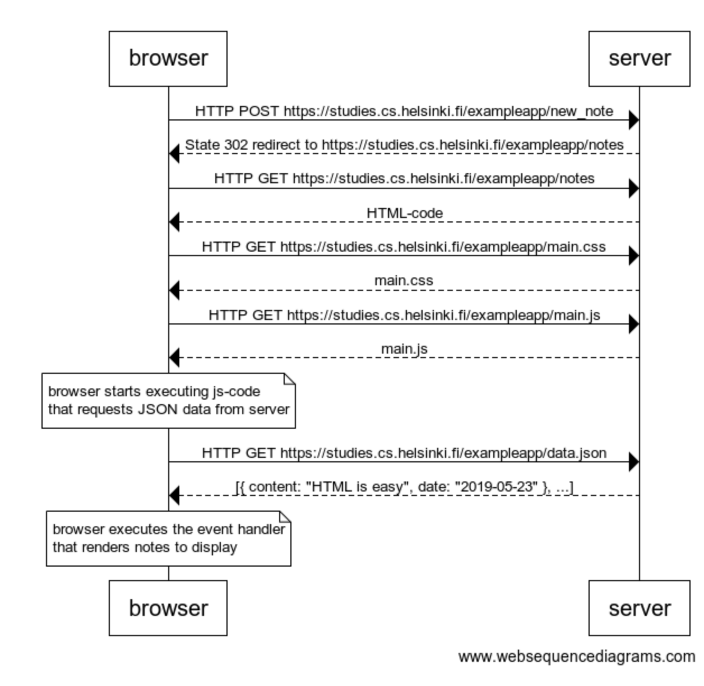
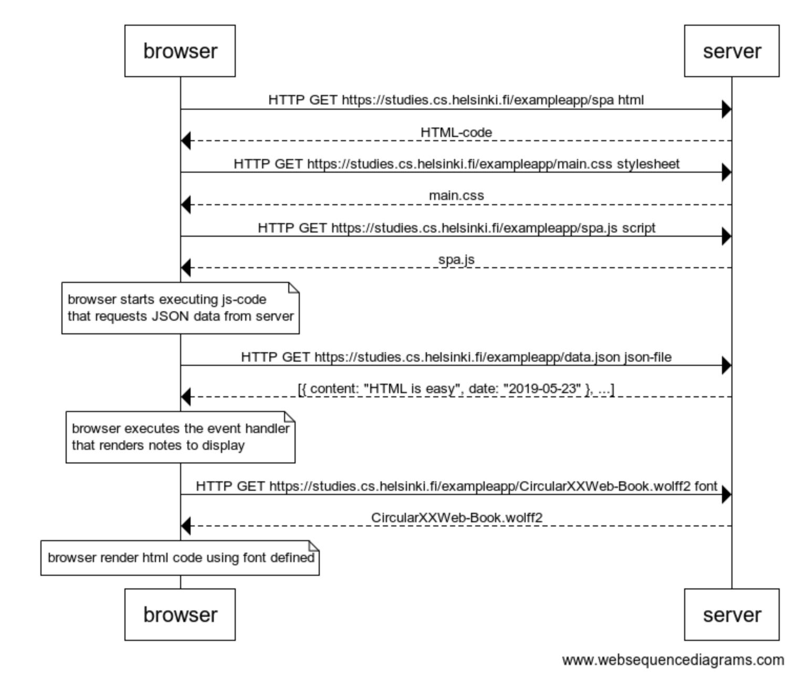
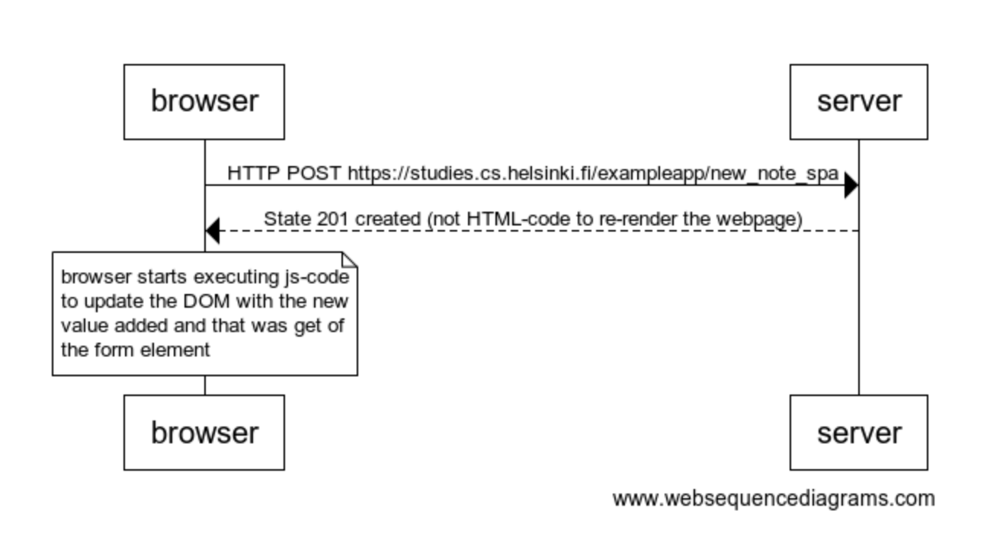

# Answers to Part0 - Fundamentals of Web apps

_https://fullstackopen.com/en/part0_

## 0.4: New note diagram

Diagram of communication browser-server after click in new note

<pre>
browser->server: HTTP POST https://studies.cs.helsinki.fi/exampleapp/new_note
server-->browser: State 302 redirect to https://studies.cs.helsinki.fi/exampleapp/notes
browser->server: HTTP GET https://studies.cs.helsinki.fi/exampleapp/notes
server-->browser: HTML-code
browser->server: HTTP GET https://studies.cs.helsinki.fi/exampleapp/main.css
server-->browser: main.css
browser->server: HTTP GET https://studies.cs.helsinki.fi/exampleapp/main.js
server-->browser: main.js

note over browser:
browser starts executing js-code
that requests JSON data from server
end note

browser->server: HTTP GET https://studies.cs.helsinki.fi/exampleapp/data.json
server-->browser: [{ content: "HTML is easy", date: "2019-05-23" }, ...]

note over browser:
browser executes the event handler
that renders notes to display
end note

</pre>

## 0.5: Single page app diagram

Diagram of communication browser-server when website of note spa is visited

<pre>
browser->server: HTTP GET https://studies.cs.helsinki.fi/exampleapp/spa html
server-->browser: HTML-code
browser->server: HTTP GET https://studies.cs.helsinki.fi/exampleapp/main.css stylesheet
server-->browser: main.css
browser->server: HTTP GET https://studies.cs.helsinki.fi/exampleapp/spa.js script
server-->browser: spa.js

note over browser:
browser starts executing js-code
that requests JSON data from server
end note

browser->server: HTTP GET https://studies.cs.helsinki.fi/exampleapp/data.json json-file
server-->browser: [{ content: "HTML is easy", date: "2019-05-23" }, ...]

note over browser:
browser executes the event handler
that renders notes to display
end note

browser->server: HTTP GET https://studies.cs.helsinki.fi/exampleapp/CircularXXWeb-Book.wolff2 font
server-->browser: CircularXXWeb-Book.wolff2

note over browser:
browser render html code using font defined
end note

</pre>

## 0.6: New note in Single page app diagram

Diagram of communication browser-server after click in new note in spa

<pre>
browser->server: HTTP POST https://studies.cs.helsinki.fi/exampleapp/new_note_spa
server-->browser: State 201 created (not HTML-code to re-render the webpage)

note over browser:
browser starts executing js-code
to update the DOM with the new
value added and that was get of
the form element
end note

</pre>

